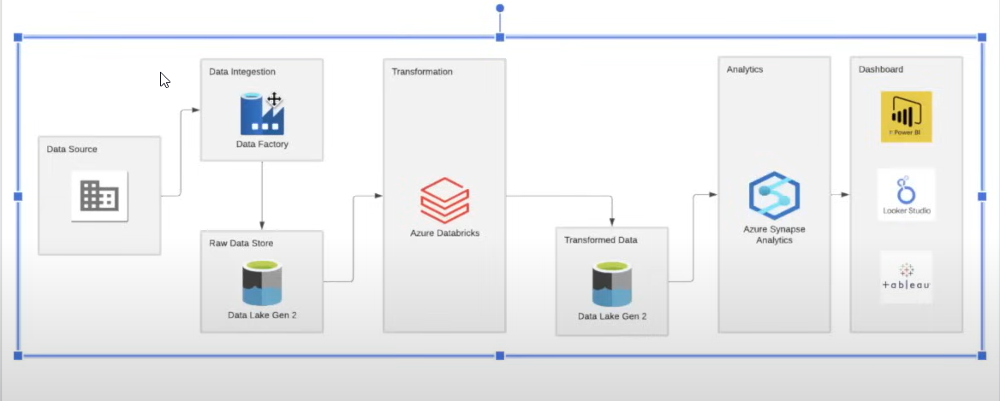

# tokyo-olympic-azure-data-engineering-project
tokyo-olympic-azure-data-engineering-project
# Tokyo Olympic Azure Data Engineering Project

## Overview
This project showcases a modern data engineering pipeline built on Azure, designed to ingest, transform, and analyze data related to the Tokyo Olympics. It leverages Azure's ecosystem including Data Factory, Data Lake Storage Gen 2, Databricks, and Synapse Analytics, combined with leading BI tools for visualization.

---

## Architecture

  
*Diagram illustrates the flow from data ingestion to dashboards.*

- **Data Source:** Raw data related to the Tokyo Olympics.
- **Data Ingestion:** Azure Data Factory orchestrates data pipelines to ingest raw data into Azure Data Lake Gen 2.
- **Raw Data Store:** Azure Data Lake Gen 2 holds raw datasets.
- **Transformation:** Azure Databricks performs ETL transformations to clean and enrich the data.
- **Transformed Data Store:** Cleaned data is stored back in Azure Data Lake Gen 2.
- **Analytics:** Azure Synapse Analytics queries transformed data for insights.
- **Dashboard:** Data visualizations are created using Power BI, Looker Studio, and Tableau.

---

## Technologies Used
- **Azure Data Factory:** Data orchestration and pipeline management.
- **Azure Data Lake Storage Gen 2:** Scalable data storage for raw and transformed data.
- **Azure Databricks:** Spark-based data transformation and processing.
- **Azure Synapse Analytics:** Analytical querying and data warehousing.
- **BI Tools:** Power BI, Looker Studio, Tableau for dashboards and reporting.

---

## Setup & Usage

1. **Configure Azure Data Factory pipelines** to ingest data from source systems.
2. **Set up Azure Data Lake Gen 2** to store raw and processed datasets.
3. **Develop ETL notebooks/scripts** in Azure Databricks for transformation tasks.
4. **Load transformed data** into Azure Synapse Analytics for efficient querying.
5. **Connect BI tools** to Synapse or Data Lake for visualization and reporting.

---

## Contribution

Contributions and improvements are welcome. For any questions or collaboration requests, please open an issue or reach out directly.

---

## License

This project is licensed under the MIT License.
